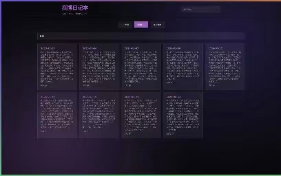
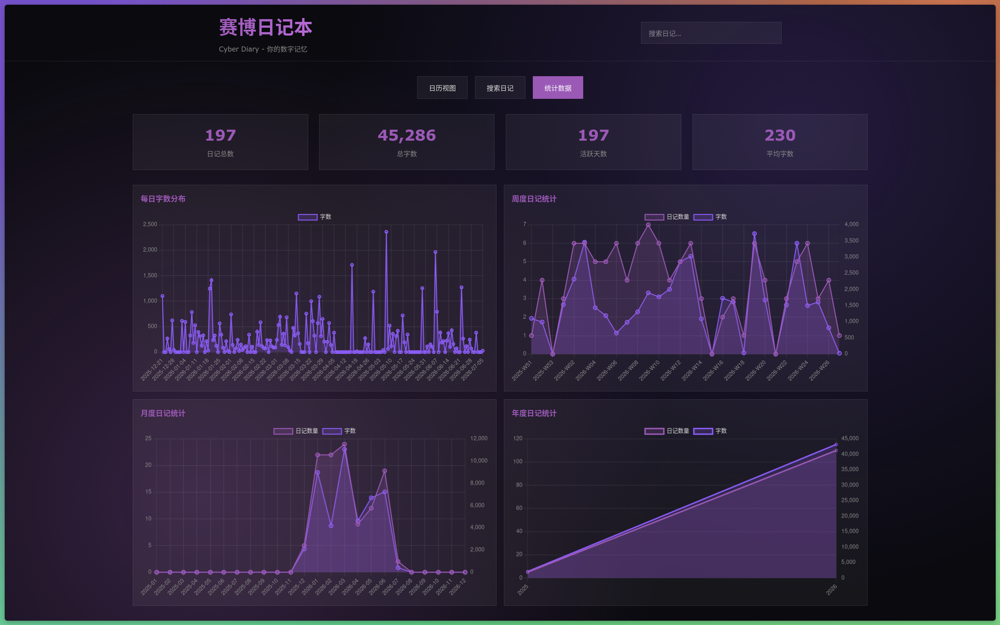

# 赛博日记本

一个基于 Electron 的本地可视化日记管理桌面应用，将 Markdown 格式的日记文件转换为精美的交互式网页，支持日历视图、全文搜索和数据统计功能。所有数据存储在本地，无需联网，完全掌控你的日记文件。






---

## 目录

- [技术栈](#技术栈)
- [功能特性](#功能特性)
- [安装步骤](#安装步骤)
- [使用方法](#使用方法)
- [界面风格](#界面风格)
- [常见问题](#常见问题)
- [项目结构](#项目结构)

---

## 技术栈

| 层级 | 技术 | 说明 |
|---|---|---|
| 桌面框架 | Electron 43+ | 主进程预渲染 HTML，渲染进程 `loadFile()` 加载本地页面，无 IPC/preload |
| 构建脚本 | Node.js CommonJS | `index.js` 读取 `diary/*.md`，注入 JSON 到 `template.html` |
| 模板引擎 | 原生字符串替换 | `{{DIARIES_DATA}}` / `{{STATS_DATA}}` 构建时替换 |
| Markdown 渲染 | markdown-it 14+ | 支持 HTML、链接、typographer |
| 图表库 | Chart.js 4.4.7 | 本地 `libs/chart.min.js`，不依赖 CDN |
| 打包工具 | electron-builder 26+ | 支持 macOS / Windows / Linux 打包 |

---

## 功能特性

### 1. 日历视图
- 以月历形式展示所有日记
- 有日记的日期显示紫色方块标记
- 方块大小根据日记字数动态变化（字数越多，方块越大）
- 点击日期可查看日记详情

### 2. 日记详情面板
- 右侧弹出详情面板（宽度 500px）
- 支持 Markdown 渲染
- 显示日记字数统计

### 3. 全文搜索
- 顶部搜索框支持按内容搜索
- 搜索结果显示日记预览（200 字）
- 实时匹配高亮

### 4. 统计图表
- **每日统计**：按日期统计字数
- **每周统计**：按周统计日记数量和字数
- **每月统计**：按月统计日记数量和字数
- **每年统计**：按年统计日记数量和字数
- 无日记的日期显示为 0
- 可点击图例小圆点快速跳转到对应日记

### 5. 年份/月份导航
- 年份/月份下拉选择器
- 上一月/下一月快捷切换
- 支持快速跳转到任意年月

### 6. 主题切换
- **赛博朋克**：默认紫色赛博朋克风格（深色背景 + 紫色主色调）
- **21th 简约**：浅色背景 + 蓝色强调色
- 主题切换后保持当前页面不变

---

## 安装步骤

### 环境要求

- **Node.js** 14+（推荐 18+）
- **npm**（随 Node.js 自带）

### 克隆仓库

```bash
git clone <repository-url>
cd cyber-diary
```

### 安装依赖

```bash
npm install
```

> 安装完成后 `postinstall` 会自动执行 `npm run prepare`，将 Chart.js 复制到 `libs/` 目录。

---

## 使用方法

### 开发模式（推荐）

```bash
npm run dev
```

该命令会：
1. 执行 `npm run build`，读取 `diary/*.md`，生成 `build/index.html` 并复制 `resources/`
2. 启动 Electron，加载本地 `build/index.html`
3. 自动打开 DevTools

开发模式下数据目录为项目内的 `diary/`，你可以直接编辑其中的 Markdown 文件。

### 构建 HTML（不启动 Electron）

```bash
npm run build
```

输出：
- `build/index.html` — 包含所有日记数据和统计信息的单页应用
- `build/resources/` — 复制自 `resources/`

### CLI 模式（兼容旧用法）

```bash
node index.js --dir /path/to/custom-diary
```

不传入 `--dir` 时默认使用项目内 `diary/` 目录。

### 打包成桌面应用

```bash
npm run dist
```

打包产物位于 `dist/` 目录：
- **macOS**：`.dmg` 文件
- **Windows**：`.exe` 安装包
- **Linux**：`.AppImage` 文件

打包配置说明：
- `asar: true` — 源码打包为 asar
- `asarUnpack: diary/**/*` — 开发模板数据不打包进 asar
- `extraResources: [{ from: 'diary', to: 'diary' }]` — 包含初始日记模板

生产环境首次启动时，应用会自动将打包的 `diary/` 复制到 `app.getPath('userData')/diary`，之后用户可直接编辑该目录下的日记文件。

---

## 日记文件规范

在 `diary/` 文件夹中创建 Markdown 格式的日记文件，文件名必须遵循以下格式：

**格式一**：
```
yyyyMMdd.md
```

例如：
- `20260606.md`（2026年6月6日）
- `20260705.md`（2026年7月5日）

**格式二**：
```
yyMMdd.md
```

例如：
- `260606.md`（自动转换为2026年6月6日）
- `260705.md`（自动转换为2026年7月5日）

> **提示**：6 位日期格式会自动添加 `"20"` 前缀，转换为 `20xx` 年的日期。

**注意**：
- 文件名必须是纯数字的日期格式
- 文件内容使用标准 Markdown 语法
- 支持标题、列表、加粗、链接等 Markdown 特性

### 示例日记内容

```markdown
# 今天的心情

今天天气很好，阳光明媚。

## 工作
- 完成了项目报告
- 参加了团队会议

## 生活
晚上和朋友一起吃了火锅，很开心！

> 生活不止眼前的苟且，还有诗和远方。
```

---

## 界面风格

### 紫色赛博朋克风格（默认）
- **主题色**：紫色（`#9b59b6`）
- **背景**：深色赛博朋克风格，带渐变光晕效果（`#0a0a0f`）
- **卡片**：半透明毛玻璃效果（`rgba(255,255,255,0.05)`）
- **页面风格**：半透明方角设计
- **下拉菜单**：紫色半透明边框，毛玻璃效果

### 21th 简约风格
- **主题色**：蓝色（`#0040ff`）
- **背景**：浅色简约风格（`#c5c9c9`）
- **卡片**：白色背景，深色边框
- **字体**：Geist 字体
- **页面风格**：方角设计，带阴影效果

---

## 常见问题

### Q：如何更新日记？
A：修改 `diary/` 文件夹中的 Markdown 文件后，重新运行 `npm run build` 或重启应用即可更新。

### Q：打包后日记数据存在哪里？
A：首次启动时从打包资源复制到 `app.getPath('userData')/diary`，之后该目录完全由用户控制，更新版本时不会被覆盖。

### Q：为什么某些日期没有显示？
A：系统会自动填充第一篇和最后一篇日记之间的所有日期。如果日期超出这个范围，则不会显示。

### Q：搜索结果预览字数可以调整吗？
A：可以在 `index.js` 第 38 行修改预览字数。

### Q：如何删除日记？
A：直接删除 `diary/` 文件夹中对应的 `.md` 文件，重新构建即可。

### Q：应用可以离线使用吗？
A：可以。Chart.js 已本地化到 `libs/chart.min.js`，不依赖任何 CDN，完全离线可用。

---

## 项目结构

```
cyber-diary/
├── main.js            # Electron 主进程入口
├── index.js           # 构建脚本，导出 build(diaryDir)
├── prepare.js         # 复制 Chart.js 到 libs/
├── template.html      # HTML 模板（自包含 CSS+JS）
├── package.json       # 项目配置 + electron-builder 配置
├── diary/             # 日记文件存放目录（开发环境）
├── resources/         # 静态资源（图片等）
├── build/             # 生成的 HTML 文件（git-tracked）
│   └── resources/     # 复制自 resources/
├── libs/              # 本地第三方库
│   └── chart.min.js   # Chart.js 本地副本
└── extra/             # 实验性备用模板
```

---

## 开发说明

### 数据流

```
diary/*.md  →  index.js (markdown-it render + stats)  →  build/index.html
```

`template.html` 中的 `{{DIARIES_DATA}}` 和 `{{STATS_DATA}}` 在构建时被替换为 JSON 数据。

### 重要约束

- `build/index.html` 与 `build/resources/` 是 **git-tracked** 产物，修改 `template.html` 或 JS 后需运行 `npm run build` 再提交
- `diary/*.md` 内容不得删除或修改（除非明确要求）
- `template.html` 中 Chart.js 必须保持本地路径 `../libs/chart.min.js`，不得改回 CDN
- 不要添加框架、bundler 或 transpiler（除非明确要求）
